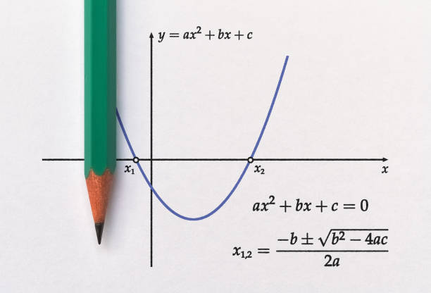
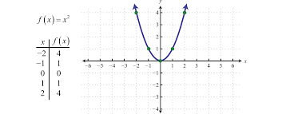
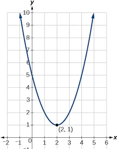

# 2.9.4 QuadraticFormula
This lab deals with finding solutions to quadratic equations in algebra using the <b>quadratic formula</b>. Quadratic equations contain variables of degree 2, such as `x^2` or `y^2`.

The <b>quadratic formula</b> states that where the standard form of a quadratic equation is equal to zero given coefficient values a, b and c, `ax^2 + bx + c = 0`, the solutions for x, or <b>roots</b> of the equation, <b>the locations on the number line where the graph of the curve produced by the equation crosses the x axis</b> (where y = 0), can be calculated using this formula:

x = (-b ± √(b² - 4ac)) / (2a)

There can be <b>two solutions</b>, <b>one solution</b> or <b>no solutions</b> to any given quadratic equation depending on how many times the graph of the equation crosses the x axis. The graph you see below has two solutions since the curve crosses the x axis twice.



These two images show one solution where the curve touches in only one x location on the number line, and no solutions where the curve doesn’t even cross the x axis.




- - -
<b>Write a program</b> to calculate the values of x for equations with input values guaranteed <b>always</b> to have two solutions. Allow the user to enter the values for int variables a, b and c, and then calculate both solutions to the equation. A sample run for the equation `x^2 + 5x + 6 = 0` would look like this.
```
Enter the values for a, b and cL 1 5 6
x = -2.0 and -3.0
```

<b>Before you write the program</b> use the quadratic equation to solve the following equations for x and then test your program using values for a, b and c for these equations.
```
x^2 + 5x + 6 = 0

x^2 + 4x + 2 = 0

-2x^2 + 12x - 16 = 0
```

Sample output:
```
Enter the values for a, b and c: 1 5 6
x = -2.0 and -3.0

Enter the values for a, b and c: 1 4 2
x = -0.5857864376269049 and -3.414213562373095

Enter the values for a, b and c: -2 12 -16
x = 2.0 and 4.0
```