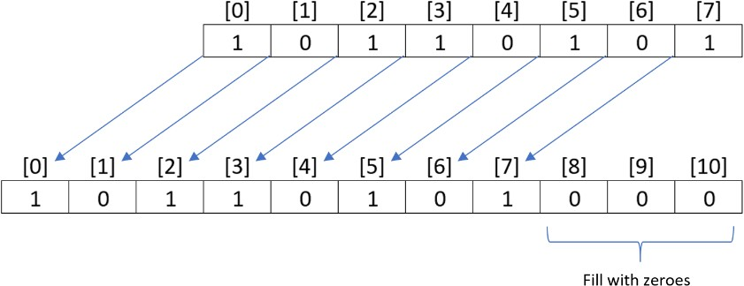

# 6.4.4 LeftShift
A classic algorithm taking all elements of an array shifting them to the left is called Left Shift. In this lab you will write a method that implements the leftShift algorithm. Here is a basic description of this process.

<b>Starting with an integer array of binary values, zeroes and ones only, such as shown in the image below, and inputting an integer from the keyboard, say the value 3, perform a “left shift” the number of places indicated by the input value. The image below shows the result of calling leftShift(3).</b>

Two sample runs are shown below the illustration of the process.


```
1 0 1 1 0 1 0 1
Enter shift value ==>3
1 0 1 1 0 1 0 1 0 0 0
```

```
1 0 1 1 0 1 0 1
Enter shift value ==>6
1 0 1 1 0 1 0 1 0 0 0 0 0 0
```

Remember arrays are static in size, which means you cannot expand the size of an existing array. Think about what that means, and then come up with a plan to solve this lab. The program shell is shown in the editor. Use the analysis, design, implement and test process demonstrated several times in earlier lessons to help solve this lab.